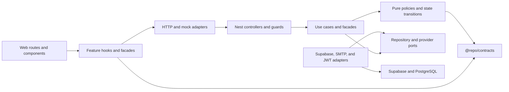

# CRA Architecture

This monorepo is an incrementally layered modular monolith. Features stay
independently understandable while sharing wire contracts and deterministic
policies through `@repo/contracts`. Existing routes and public APIs remain
compatibility facades while implementation moves behind explicit use cases and
ports.

## Dependency direction



Inside a layered feature, dependencies point from presentation to application
to domain. Infrastructure adapters depend inward on ports owned by the
application or domain side. Domain code never imports a framework, provider,
controller, module, or adapter.

Create these layers only when a feature has code that belongs in them. Empty
`domain`, `application`, or `infrastructure` directories are architecture
theatre and are not allowed.

## Layer responsibilities

- Presentation translates HTTP or UI events, validates boundary input, invokes
  one feature entry point, and maps the result. It contains no provider query or
  domain decision.
- Application coordinates one use case. It owns ports, transaction intent,
  idempotency decisions, and immutable command/query inputs.
- Domain contains deterministic policies, value objects, and legal state
  transitions. It is framework-free and side-effect-free.
- Infrastructure implements ports for Supabase, GoTrue, SMTP, JWT/JWKS, and
  browser HTTP. It maps provider errors into stable application outcomes.
- Composition roots wire concrete adapters to ports. No service locator or
  request identity singleton may hide dependencies.

## Non-negotiable compatibility and security invariants

1. API traffic stays under `/api/v1`.
2. `cra_at` stays HttpOnly at `/`; `cra_rt` stays HttpOnly at
   `/api/v1/auth/refresh`. Browser cookies are routing hints, never an
   authorization source.
3. Access tokens remain algorithm-aware: HS256 where configured and
   ES256/JWKS for asymmetric Supabase projects.
4. Authentication is global and deny-by-default. Public routes are an explicit
   allowlist, and every authenticated route declares permission, role, or a
   reasoned self-scope.
5. Service-role access is explicitly tenant-scoped. An organization-sensitive
   operation takes `orgId` first unless its scope comes directly from verified
   identity.
6. Permission resolution order remains base-role defaults, additive custom
   roles, implications, then organization overrides as the final word.
7. Authorization uncertainty fails closed. Menu rendering may fail open because
   UI visibility is not a security boundary.
8. Web API passthrough remains the first MSW handler, and the existing dashboard
   mock namespaces remain owned by their current handlers.
9. The eight auth-action signatures remain unchanged.
10. Shared UI uses semantic tokens, `cn()`, and `@repo/ui/*` subpath imports.
11. Security-critical effects are synchronous or transactionally durable.
    In-process events may notify, but may not authorize, revoke, reset, or
    complete MFA.
12. Database changes are additive and generated types are regenerated, never
    hand-edited.

## Pattern policy

Patterns solve demonstrated problems; they are not a quota. Use the
[pattern selection matrix](./pattern-selection-matrix.md) to compare the
smallest suitable design, and complete the
[feature design template](./feature-design-template.md) before introducing a
new abstraction. The governing decision is
[ADR-0001](./adrs/ADR-0001-pattern-selection.md).

Developers and coding agents must also follow the
[implementation checklist](../ai/coding-rules.md). The short, always-loaded
rules live in the root `AGENTS.md`; the detailed documents explain their
rationale and must not weaken them.

## Verification

Architecture documents are executable policy:

```sh
node --test scripts/architecture/verify-docs.test.mjs
node scripts/architecture/verify-docs.mjs
```

Dependency, design-system, fast, live-stack, and coverage gates are added by
the implementation plans in `docs/superpowers/plans`. A feature is not complete
until its focused tests, failure-injection tests, applicable live tests, and the
repository verification gate all pass.
