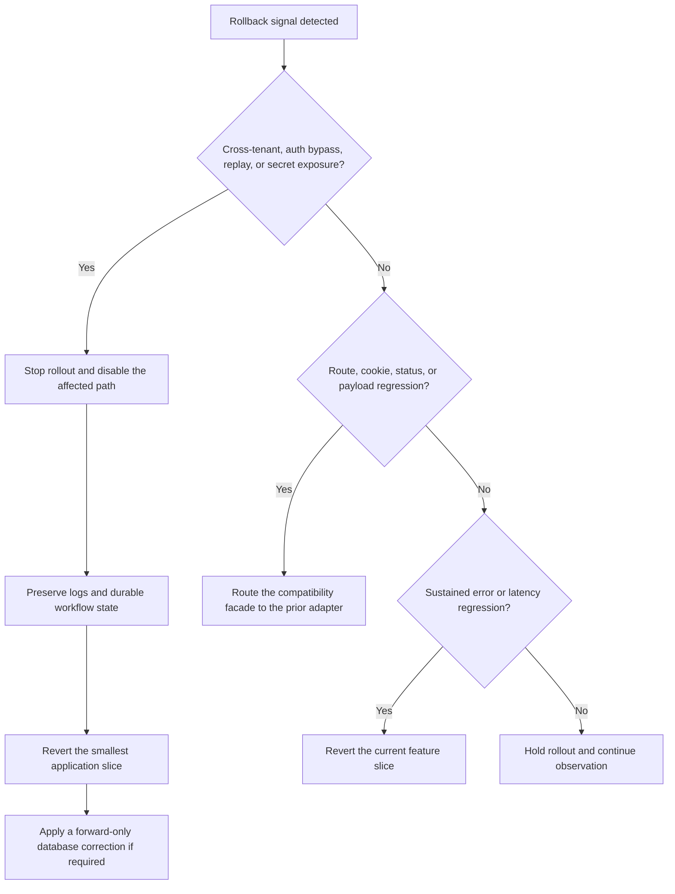

# Architecture Rollout and Rollback Runbook

Use this runbook for each independently deployable architecture slice. Database
rollback is forward-only after a migration reaches any shared environment.
Never delete or rewrite an applied migration, unconsume a credential, move a
session epoch backward, or erase a failed recovery operation.

## Release units

| Unit                             | Deploy prerequisite                                             | Positive signal                                                          | Rollback signal                                                               | Rollback action                                                       |
| -------------------------------- | --------------------------------------------------------------- | ------------------------------------------------------------------------ | ----------------------------------------------------------------------------- | --------------------------------------------------------------------- |
| Permission outage posture        | Focused resolver, guard, and live authorization tests           | A revoked grant is never served from cache                               | Healthy database causes elevated `permissions_unavailable`                    | Revert only the service/proxy change                                  |
| Lockout enforcement              | Sign-in/unlock unit and browser journeys                        | Wrong unlocks increment the durable counter and the fifth returns 429    | Valid unlocks are incorrectly locked                                          | Restore the prior password-verification facade; keep database records |
| Session refresh routing          | Cookie, middleware, and browser tests                           | Expired access sessions refresh once and continue                        | Redirect loop, widened cookie path, or marker not cleared                     | Revert routing code; keep `/api/v1/auth/refresh` unchanged            |
| Atomic identity RPCs             | Schema lint, grants, RLS, concurrency, and API adapter tests    | Outcome enums are deterministic under concurrent calls                   | Lock contention, malformed outcome, or invariant failure                      | Stop new callers and apply a forward corrective migration             |
| Invitation workflow              | Use-case, adapter, live mail, and double-accept tests           | Existing payloads remain stable and double acceptance is idempotent      | Status/body drift or duplicate membership                                     | Route the facade to the prior implementation; retain additive RPCs    |
| Member and role workflows        | Tenant-filter, audit, invariant, and permission tests           | Every service-role query is organization-scoped                          | Cross-organization access or last-owner regression                            | Revert only the current feature facade/adapters                       |
| Authentication and MFA workflows | Atomic RPC, token strategy, timing, cookie, and live auth tests | Consumed credentials cannot replay and recovery resumes safely           | Sign-in outage, replay, secret logging, or incomplete recovery without resume | Restore compatibility facade calls; retain durable operation state    |
| Typed web adapters               | Contract, component, refresh, and production build tests        | Validation failures are observable and safe GET refresh is single-flight | Mutation retry, request loop, or visible behavior regression                  | Restore the prior feature adapter; never widen retry rules            |
| Security composition             | Guard-order and route-metadata tests                            | Throttling precedes authentication and authorization                     | Public/protected route drift or duplicate guard execution                     | Restore the prior module wiring while retaining guard implementations |

## Before deployment

- Run focused tests for the changed feature, including provider failures and
  concurrency/idempotency cases.
- Require at least 80% statement, branch, function, and line coverage for every
  new or materially refactored module.
- Run lint, typecheck, API/web production builds, and `pnpm test:architecture`.
- Run the applicable local Supabase RLS/RPC and browser journeys without retry.
- Run the secret scan and dependency audit; verify no generated database type
  was hand-edited.
- Confirm `/api/v1`, `cra_at`, the `cra_rt` refresh-only path, ES256/JWKS
  support, zero epoch skew, permission merge order, and first MSW passthrough.
- Record a pre-release baseline for 401, 403, 429, 500, and 503 responses plus
  the feature-specific outcome codes.

## Deployment sequence

1. Apply additive schema/RPC changes and verify grants, `search_path`, RLS, and
   compatibility with the currently deployed application.
2. Deploy one API compatibility-facade slice. Observe it before deploying a
   dependent browser slice.
3. Deploy the browser adapter/page slice and verify real and mock modes.
4. Compare error/outcome rates with the pre-release baseline. Continue only
   when the positive signal is present and no rollback signal is rising.
5. Keep compatibility facades for at least one stable release. Remove them in a
   separate cleanup change, never in the migration release.

## Rollback decision tree

## After deployment

Inspect structured counts for `permissions_unavailable`, `account_locked`,
refresh outcomes, invitation outcome enums, MFA recovery states, adapter
validation failures, and 401/403/429/503 rates. Confirm no stale permission is
served after a version change and no security-critical operation remains in an
in-process-only observer. Document the decision and evidence before starting
the next release unit.
