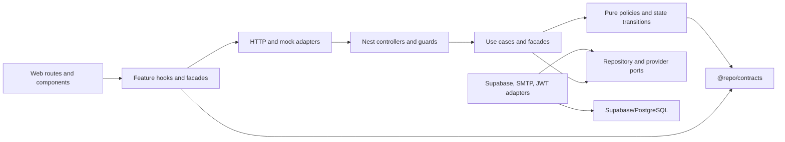

# Design Pattern Architecture Foundation Implementation Plan

> **For agentic workers:** REQUIRED SUB-SKILL: Use superpowers:subagent-driven-development (recommended) or superpowers:executing-plans to implement this plan task-by-task. Steps use checkbox (`- [ ]`) syntax for tracking.

**Goal:** Establish an enforceable architecture standard that evaluates all 22 patterns in _Dive Into Design Patterns_, preserves CRA's existing contracts, and requires future features to select the smallest justified pattern set.

**Architecture:** Keep the monorepo feature-oriented and introduce explicit dependency direction inside features: presentation -> application -> domain, with adapters implementing ports owned by the application/domain side. GoF patterns are a decision catalogue, not a quota: every pattern is classified as existing, approved when triggered, or deferred, and every new feature records why its selected patterns are simpler than the alternatives.

**Tech Stack:** Node.js 20+, pnpm 10.33.4, Turborepo 2, TypeScript 5.9.2, NestJS 11, Next.js 16, React 19, Supabase/PostgreSQL, Jest 30, Vitest 3, ESLint 9, dependency-cruiser.

## Global Constraints

- Use Node 20+ and pnpm only; do not add npm or Yarn lockfiles.
- Preserve the API prefix `/api/v1`, the passthrough-first MSW rule, and the frozen eight `auth-actions.ts` signatures.
- Preserve `cra_at` at `/` and `cra_rt` at `/api/v1/auth/refresh`; never widen the refresh-cookie path.
- Preserve algorithm-aware HS256/JWKS verification and ES256 support in API and web middleware.
- Preserve global deny-by-default authentication and permission metadata coverage.
- Every service-role query is self-scoped from verified identity or takes `orgId` as its first argument and applies the organization filter.
- Preserve permission resolution order: base role -> additive custom roles -> implications -> organization overrides as the last word.
- Preserve fail-open menu rendering while loading/error; UI visibility is not authorization.
- Keep generated database type copies generated; never hand-edit either database type file.
- Write tests before implementation and reach at least 80% coverage on every new or materially refactored module.
- Prefer immutable data and composition; do not introduce inheritance merely to resemble a book example.
- Use semantic design tokens, `cn()`, and `@repo/ui/*` subpath imports.
- Run focused tests before the full `pnpm test`, `pnpm lint`, `pnpm check-types`, and `pnpm build` gates.
- Commit with a short human-written subject of 72 characters or fewer, without AI attribution or an em dash.

---

## Current Baseline and Audit Result

The 2026-08-09 baseline is green:

- `pnpm test`: PASS, including live RLS/schema invariants.
- `pnpm lint`: PASS.
- `pnpm check-types`: PASS.
- `pnpm build`: PASS.
- API Jest coverage: 39.08% statements, 33.92% branches, 25% functions, 36.62% lines.

The architecture already uses several patterns well. The main problem is not a lack of pattern names; it is that `AuthService`, `MfaService`, `UsersService`, `InvitationsService`, `CustomRolesService`, and `PermissionsService` mix orchestration, persistence, policy, and side effects while their critical mutation paths have little direct test coverage.

Three correctness defects must be fixed before refactoring; they have their own plan in `2026-08-09-security-correctness-hotfixes.md`.

## Target Dependency Direction



Rules implied by the diagram:

1. Domain code is pure and framework-free.
2. Application code owns use-case interfaces and ports.
3. Adapters depend inward on ports; application code never imports a concrete adapter.
4. Controllers and React pages are thin entry points, not persistence clients.
5. Cross-app wire schemas and deterministic policies live in `@repo/contracts`; server-only domain rules stay in their API feature.
6. Security-critical effects remain synchronous. Observer/event delivery is allowed only for non-authoritative effects such as notifications and best-effort audit projection.

## Complete 22-Pattern Decision Matrix

| Pattern                 | CRA decision                         | Current or planned anchor                                   | Mandatory trigger                                                            | Do not use when / principal edge case                                                    |
| ----------------------- | ------------------------------------ | ----------------------------------------------------------- | ---------------------------------------------------------------------------- | ---------------------------------------------------------------------------------------- |
| Factory Method          | Keep, narrowly                       | `SupabaseService.admin/anon/asUser`; provider factories     | Construction differs by environment, privilege, or provider                  | A literal or direct constructor is clearer; never cache request/user clients             |
| Abstract Factory        | Deferred by default                  | Future coherent mock/real provider family                   | Two or more related product types must vary together                         | One product varies; adding a product would force empty factories everywhere              |
| Builder                 | Prefer immutable functions           | `URLSearchParams`, pagination response construction         | A product has ordered required steps or many validated optional parts        | A shallow Zod DTO/object literal suffices; never reuse a mutable builder across requests |
| Prototype               | Prefer defensive copy helpers        | Permission preset copies and future saved table presets     | Expensive configured values must be cloned with explicit deep-copy semantics | Native spread/`structuredClone` is sufficient; beware shared nested references           |
| Singleton               | Container-owned only                 | Nest singleton providers and cached admin client            | Stateless process-wide resource with proven lifecycle                        | Request/user/session state, hot-reload state, or mutable test state                      |
| Adapter                 | Default at external boundaries       | Supabase, GoTrue, SMTP, HTTP/MSW                            | Provider shape differs from the internal port                                | Both sides are owned and can share the same contract directly                            |
| Bridge                  | Approved when two axes vary          | Application port paired with independently varying adapter  | Abstraction and implementation both have real independent variants           | Only one dimension varies; avoid an interface for every class                            |
| Composite               | Keep for recursive models            | Menu/navigation tree                                        | Leaves and containers must be treated uniformly                              | The data is flat; enforce cycle rejection and bounded traversal                          |
| Decorator               | Framework or explicit wrapper        | Nest metadata/interceptors, UI wrappers                     | Orthogonal behavior must compose in an order that is tested                  | It hides authorization or changes semantics by order without tests                       |
| Facade                  | Default feature entry point          | Existing services, future use-case facades                  | Callers otherwise coordinate multiple subsystem objects                      | It becomes a god service or exposes every subsystem method                               |
| Flyweight               | Existing immutable data only         | Design tokens, permission/menu metadata                     | Profiling proves many repeated immutable values                              | Object count is small; shared state is mutable                                           |
| Proxy                   | Framework-owned or explicit          | Nest guards; future cache/remote proxy                      | Access, lazy initialization, or caching must preserve a subject interface    | It obscures latency/security or can be bypassed                                          |
| Chain of Responsibility | Keep explicit and ordered            | Throttle -> auth -> authorization guard chain               | Independent checks require ordered short-circuiting                          | A direct fixed workflow is easier to debug; order is not tested                          |
| Command                 | Plain immutable command records      | Mutation use cases and editor toolbar commands              | Mutation needs audit identity, idempotency, retry, or queueing               | A direct method call is enough; no global command bus without multiple consumers         |
| Iterator                | Native/async iteration first         | Arrays, menu traversal, future paged export                 | Traversal source must be hidden or streamed                                  | Native iteration is sufficient; define order and concurrent-change behavior              |
| Mediator                | Feature-local coordinator            | React feature hooks/page controllers                        | Three or more peers have many-to-many coordination                           | It becomes global application state or a god object                                      |
| Memento                 | Deferred until undo/draft feature    | Tiptap history or future permission editor drafts           | Users need restore/undo with bounded, versioned snapshots                    | No restore requirement; snapshots include secrets or grow without bound                  |
| Observer                | Existing libraries/DB triggers       | React Query, browser observers, permission-version triggers | Multiple independent non-authoritative consumers need updates                | Revocation, password reset, MFA recovery, or deactivation must complete synchronously    |
| State                   | Adopt for persisted lifecycles       | Invitation/auth/MFA transitions                             | Behavior and allowed actions vary across three or more states                | A boolean or small stable union is enough; reject illegal transitions centrally          |
| Strategy                | Default for real algorithm variation | JWT verifier; permission/cache policies                     | Two or more algorithms share a stable contract                               | Only one implementation exists; selection logic becomes more complex than algorithms     |
| Template Method         | Prefer functional pipeline           | Guard/request pipeline; no new base class by default        | Workflow skeleton is stable and several implementations vary steps           | Composition is clearer; avoid fragile base classes and optional hook forests             |
| Visitor                 | Deferred by default                  | Future menu/permission export over stable tree              | A stable element hierarchy needs several unrelated operations                | Element types change often; TypeScript double-dispatch ceremony outweighs value          |

## Book Coverage and Relationship Index

The source PDF has 410 pages. The foundational sections cover OOP (pages 8-23), the definition and anatomy of patterns (24-29), design principles including encapsulating variation, programming to interfaces, composition over inheritance, and SOLID (30-68), and the conclusion (410). Every GoF chapter was reviewed through its Problem, Solution, Structure, Applicability, Implementation, Pros/Cons, and Relations sections:

| Pattern                 | PDF start | Relationship and CRA interpretation                                                                                                                                                                                            |
| ----------------------- | --------: | ------------------------------------------------------------------------------------------------------------------------------------------------------------------------------------------------------------------------------ |
| Factory Method          |        72 | Often evolves toward Abstract Factory, Builder, or Prototype; it is also a specialization point related to Template Method. Keep construction choices at provider/composition boundaries.                                      |
| Abstract Factory        |        88 | Commonly implemented with Factory Methods or Prototypes and can return Builders. Defer until a coherent family, such as mock/real identity plus mail plus audit products, must switch together.                                |
| Builder                 |       104 | Can construct Composite trees and may be returned by Abstract Factory. Prefer validated immutable functions until construction order or optional-part explosion is real.                                                       |
| Prototype               |       123 | Can supply products for Abstract Factory and avoid subclassed factories. Use only with an explicit deep-copy contract for nested permission or view presets.                                                                   |
| Singleton               |       137 | Factory methods may return one cached instance. Limit it to container-owned stateless/process-wide resources; never store tenant, user, request, or mutable test state.                                                        |
| Adapter                 |       150 | Changes an existing interface; unlike Bridge it is usually introduced after interfaces already differ. This is the default provider-boundary pattern for Supabase, GoTrue, SMTP, and HTTP.                                     |
| Bridge                  |       163 | Structurally resembles Adapter, State, and Strategy but separates two dimensions that evolve independently. Require evidence for both axes before adding it.                                                                   |
| Composite               |       178 | Works with Builder, Iterator, Visitor, Chain, and Decorator. Retain it for menu trees with cycle rejection, stable order, bounded depth, and leaf/container parity tests.                                                      |
| Decorator               |       192 | Shares recursive shape with Composite and interface shape with Proxy. Keep framework decorators and explicit wrappers, but never conceal authorization or rely on untested wrapper order.                                      |
| Facade                  |       210 | Can shield a complex subsystem and may use Singleton for a stateless instance. Existing service names become compatibility façades while orchestration moves into focused use cases.                                           |
| Flyweight               |       220 | Shares immutable intrinsic state across many contexts and often pairs with Factory. Native module constants already cover tokens and permission metadata; add no custom pool without profiling.                                |
| Proxy                   |       234 | Shares a subject interface with the real service; Decorator adds behavior while Proxy controls access/lifecycle. Use for versioned permission caching only if outage and invalidation preserve revocation semantics.           |
| Chain of Responsibility |       251 | Can traverse Composite trees and may resemble Command. Preserve the ordered throttle, authentication, and authorization chain with short-circuit and order tests.                                                              |
| Command                 |       269 | Can support undo through Memento and is related to Strategy; Visitor can be viewed as commands over multiple receiver types. Use immutable mutation requests where identity/idempotency/audit matter, without a global bus.    |
| Iterator                |       290 | Traverses Composite structures and is often replaced by native language iteration. Use native arrays/async iterables unless pagination or streaming requires hidden traversal state.                                           |
| Mediator                |       305 | Reduces peer-to-peer coupling and often coordinates Observer notifications. Keep coordination feature-local; reject a global mediator that accumulates application behavior.                                                   |
| Memento                 |       321 | Commonly pairs with Command for undo. Defer until a concrete draft/undo requirement exists; snapshots must be versioned, bounded, encrypted where sensitive, and free of bearer secrets.                                       |
| Observer                |       337 | Often coordinates through Mediator and can resemble publisher/subscriber delivery. Keep React Query and database invalidation observers; never make authorization, revocation, reset, or MFA completion eventually consistent. |
| State                   |       353 | A specialized Strategy whose selection follows object state. Use for persisted invitation, authentication, and MFA lifecycles with one legal-transition table and concurrency tests.                                           |
| Strategy                |       369 | Structurally resembles State, Bridge, and Adapter but represents caller-selected or policy-selected algorithms. Keep JWT and policy variation explicit only when multiple real strategies exist.                               |
| Template Method         |       382 | Factory Method can serve as one of its customization steps; it competes with Strategy. Prefer functional pipelines/composition to inheritance-based skeletons in this TypeScript codebase.                                     |
| Visitor                 |       394 | Operates across stable Composite hierarchies and can use Iterator for traversal. Defer while menu/permission element types still change more often than exported operations.                                                   |

These relationships are selection aids, not instructions to combine patterns. A relation in the book creates a comparison obligation in the feature template; it does not create a dependency or class hierarchy in CRA.

## Pattern Selection Gate for Every Feature

Every feature plan and ADR must answer:

1. What is the concrete variation, lifecycle, tree, workflow, or external boundary?
2. What is the simplest direct implementation?
3. Which pattern removes a demonstrated coupling or risk?
4. Why are nearby patterns not a better fit?
5. What new failure modes does the pattern introduce?
6. What contract test proves every implementation is substitutable?
7. How can the change be rolled back without data loss or API drift?

A feature is rejected if its only rationale is “use all patterns,” “future-proofing,” or matching a class diagram from the book.

## File Structure to Create

```text
docs/
  architecture/
    README.md                         # dependency direction and invariant index
    pattern-selection-matrix.md       # the 22-pattern policy above
    feature-design-template.md        # mandatory feature/ADR questions
    adrs/
      ADR-0001-pattern-selection.md   # why patterns are selected, not mandated
  ai/
    coding-rules.md                   # concise execution rules for coding agents
scripts/
  architecture/
    verify-docs.mjs                   # checks required architecture sections/links
.github/
  workflows/
    ci.yml                            # fast and Docker-backed verification lanes
dependency-cruiser.cjs                # monorepo dependency-direction rules
```

The application-layer folder structure is introduced feature-by-feature by the API and web plans. Do not create empty `domain/`, `application/`, or `adapters/` directories as architecture theatre.

### Task 1: Record the Architecture Decision and Pattern Matrix

**Files:**

- Create: `docs/architecture/README.md`
- Create: `docs/architecture/pattern-selection-matrix.md`
- Create: `docs/architecture/feature-design-template.md`
- Create: `docs/architecture/adrs/ADR-0001-pattern-selection.md`
- Create: `scripts/architecture/verify-docs.mjs`
- Create: `scripts/architecture/verify-docs.test.mjs`

**Interfaces:**

- Consumes: existing invariants in `AGENTS.md` and the 22-pattern matrix in this plan.
- Produces: `verifyArchitectureDocs(rootDir: string): readonly string[]`, returning validation errors and never mutating files.

- [ ] **Step 1: Write the failing documentation verifier test**

```js
import assert from "node:assert/strict";
import { mkdtemp, mkdir, writeFile } from "node:fs/promises";
import { tmpdir } from "node:os";
import { join } from "node:path";
import test from "node:test";

import { verifyArchitectureDocs } from "./verify-docs.mjs";

test("requires all 22 pattern names and the feature decision questions", async () => {
  const root = await mkdtemp(join(tmpdir(), "cra-architecture-"));
  await mkdir(join(root, "docs", "architecture"), { recursive: true });
  await writeFile(
    join(root, "docs", "architecture", "pattern-selection-matrix.md"),
    "# Matrix\nFactory Method\n",
  );
  await writeFile(
    join(root, "docs", "architecture", "feature-design-template.md"),
    "# Template\n",
  );

  const errors = await verifyArchitectureDocs(root);

  assert.ok(errors.some((error) => error.includes("Visitor")));
  assert.ok(errors.some((error) => error.includes("Why not simpler?")));
});
```

- [ ] **Step 2: Run the test to verify it fails**

Run: `node --test scripts/architecture/verify-docs.test.mjs`

Expected: FAIL with `ERR_MODULE_NOT_FOUND` for `verify-docs.mjs`.

- [ ] **Step 3: Implement the verifier**

```js
import { readFile } from "node:fs/promises";
import { join } from "node:path";

const PATTERNS = Object.freeze([
  "Factory Method",
  "Abstract Factory",
  "Builder",
  "Prototype",
  "Singleton",
  "Adapter",
  "Bridge",
  "Composite",
  "Decorator",
  "Facade",
  "Flyweight",
  "Proxy",
  "Chain of Responsibility",
  "Command",
  "Iterator",
  "Mediator",
  "Memento",
  "Observer",
  "State",
  "Strategy",
  "Template Method",
  "Visitor",
]);

export async function verifyArchitectureDocs(rootDir) {
  const matrix = await readFile(
    join(rootDir, "docs", "architecture", "pattern-selection-matrix.md"),
    "utf8",
  );
  const template = await readFile(
    join(rootDir, "docs", "architecture", "feature-design-template.md"),
    "utf8",
  );
  return Object.freeze([
    ...PATTERNS.filter((pattern) => !matrix.includes(pattern)).map(
      (pattern) => `Pattern matrix is missing ${pattern}`,
    ),
    ...["Concrete problem", "Why not simpler?", "Failure modes", "Rollback"]
      .filter((heading) => !template.includes(heading))
      .map((heading) => `Feature template is missing ${heading}`),
  ]);
}

if (import.meta.url === `file://${process.argv[1]}`) {
  const errors = await verifyArchitectureDocs(process.cwd());
  if (errors.length > 0) {
    console.error(errors.join("\n"));
    process.exitCode = 1;
  }
}
```

- [ ] **Step 4: Create the four architecture documents with exact policy**

Use the matrix, dependency diagram, selection gate, baseline, and constraints from this plan verbatim where applicable. `feature-design-template.md` must contain this checkable section:

```markdown
## Concrete problem

Describe the observed coupling, variation, lifecycle, recursive structure, or boundary.

## Why not simpler?

Show the direct implementation first and explain why it fails the requirement.

## Selected patterns

For each pattern, name its participants in this feature and its failure modes.

## Rejected patterns

Record nearby patterns considered and why they add ceremony or risk.

## Tests and observability

List contract, unit, integration, E2E, failure-injection, and live-stack tests.

## Rollback

State the code, configuration, migration, and data rollback path.
```

- [ ] **Step 5: Run documentation verification**

Run: `node --test scripts/architecture/verify-docs.test.mjs && node scripts/architecture/verify-docs.mjs`

Expected: PASS with no missing patterns or headings.

- [ ] **Step 6: Commit**

```bash
git add docs/architecture scripts/architecture
git commit -m "docs: define architecture pattern policy"
```

### Task 2: Make the Rules Discoverable to Coding Agents

**Files:**

- Modify: `AGENTS.md:1-47`
- Create: `docs/ai/coding-rules.md`
- Modify: `docs/architecture/README.md`
- Test: `scripts/architecture/verify-docs.test.mjs`

**Interfaces:**

- Consumes: architecture policy from Task 1.
- Produces: a short root rule set that links to the detailed policy and is automatically validated.

- [ ] **Step 1: Extend the verifier test with required agent rules**

```js
test("requires enforceable agent rules in the root guide", async () => {
  const errors = await verifyArchitectureDocs(process.cwd());
  assert.deepEqual(
    errors.filter((error) => error.startsWith("AGENTS.md")),
    [],
  );
});
```

Update `verifyArchitectureDocs` to read `AGENTS.md` and require these exact phrases:

```js
const REQUIRED_AGENT_RULES = Object.freeze([
  "Patterns solve demonstrated problems; they are not a quota",
  "presentation -> application -> domain",
  "No direct Supabase access from controllers",
  "orgId as its first argument",
  "80% coverage",
  "docs/architecture/feature-design-template.md",
]);
```

- [ ] **Step 2: Run the test to verify it fails**

Run: `node --test scripts/architecture/verify-docs.test.mjs`

Expected: FAIL listing the missing `AGENTS.md` rules.

- [ ] **Step 3: Add the concise root architecture rules**

Append this section to `AGENTS.md`:

```markdown
## Design Pattern Architecture

Patterns solve demonstrated problems; they are not a quota. For every feature,
complete `docs/architecture/feature-design-template.md` and use the selection
matrix in `docs/architecture/pattern-selection-matrix.md`.

- Dependency direction inside a layered feature is presentation -> application -> domain; adapters implement inward-owned ports.
- Controllers and pages stay thin. No direct Supabase access from controllers, React pages, or shared UI.
- Every service-role operation is self-scoped from verified identity or takes `orgId` as its first argument and applies the organization filter.
- Prefer immutable functions and composition. A new class hierarchy, global singleton, command bus, event bus, abstract factory, template base class, memento store, or visitor requires a concrete trigger and ADR.
- Security-critical effects are synchronous. Browser state is never an authorization source.
- Write the failing test first and maintain at least 80% coverage for every new or materially refactored module.
- Preserve the API, cookies, auth-action signatures, permission merge order, mock namespace, and menu behavior documented above.
```

- [ ] **Step 4: Create the detailed coding checklist**

`docs/ai/coding-rules.md` must define the required sequence:

```markdown
1. Read `AGENTS.md` and the nearest feature tests.
2. Fill in the feature design template before creating abstractions.
3. Add characterization tests around every behavior being moved.
4. Add a port only when at least one adapter exists now; add a second strategy only when the second algorithm exists now.
5. Keep controllers/pages free of provider calls and domain decisions.
6. Validate inputs at boundaries with `@repo/contracts` Zod schemas.
7. Inject failures for database, JWKS, SMTP, network, duplicate request, stale state, and authorization paths relevant to the feature.
8. Run focused tests, coverage for touched modules, live tests when cookies/triggers/mail change, then the full verification gate.
9. Review the diff for secret leakage, tenant filters, error semantics, backward compatibility, and rollback.
```

- [ ] **Step 5: Verify and commit**

Run: `node --test scripts/architecture/verify-docs.test.mjs && node scripts/architecture/verify-docs.mjs`

Expected: PASS.

```bash
git add AGENTS.md docs/ai docs/architecture/README.md scripts/architecture
git commit -m "docs: add feature architecture rules"
```

### Task 3: Enforce Monorepo Dependency Direction

**Files:**

- Create: `dependency-cruiser.cjs`
- Modify: `package.json:5-31`
- Modify: `pnpm-lock.yaml`

**Interfaces:**

- Consumes: filesystem module graph rooted at `apps` and `packages`.
- Produces: `pnpm test:architecture`, which exits nonzero on a forbidden dependency.

- [ ] **Step 1: Add dependency-cruiser with pnpm**

Run: `pnpm add -Dw dependency-cruiser`

Expected: root `package.json` and `pnpm-lock.yaml` change; no other lockfile appears.

- [ ] **Step 2: Add a deliberately failing boundary rule first**

Create `dependency-cruiser.cjs` initially with the `no-packages-to-apps` rule and validate a temporary fixture import under `packages/contracts/src/architecture-invalid.fixture.ts`:

```js
/** @type {import('dependency-cruiser').IConfiguration} */
module.exports = {
  forbidden: [
    {
      name: "no-packages-to-apps",
      severity: "error",
      from: { path: "^packages/" },
      to: { path: "^apps/" },
    },
  ],
  options: {
    doNotFollow: { path: "node_modules" },
    exclude: "(^|/)(dist|build|coverage|\\.next|node_modules)/",
    tsPreCompilationDeps: true,
  },
};
```

Fixture content:

```ts
export { AppModule } from "../../../apps/api/src/app.module";
```

- [ ] **Step 3: Run dependency validation to verify it fails**

Run: `pnpm exec depcruise --config dependency-cruiser.cjs apps packages`

Expected: FAIL on `no-packages-to-apps` for the fixture.

- [ ] **Step 4: Delete the fixture and complete the rule set**

Use these additional rules:

```js
{
  name: "no-web-to-api-or-infrastructure",
  severity: "error",
  from: { path: "^apps/web/" },
  to: { path: "^apps/(api|infrastructure)/" },
},
{
  name: "no-api-to-web",
  severity: "error",
  from: { path: "^apps/api/" },
  to: { path: "^apps/web/" },
},
{
  name: "domain-does-not-depend-outward",
  severity: "error",
  from: { path: "^apps/api/src/[^/]+/domain/" },
  to: { path: "/(application|infrastructure|presentation)/|\\.(controller|module)\\.ts$" },
},
{
  name: "application-does-not-depend-on-adapters",
  severity: "error",
  from: { path: "^apps/api/src/[^/]+/application/" },
  to: { path: "/infrastructure/|\\.(controller|module)\\.ts$" },
},
{
  name: "core-does-not-import-provider-frameworks",
  severity: "error",
  from: { path: "^apps/api/src/[^/]+/(domain|application)/" },
  to: { path: "^(?:@nestjs/|@supabase/|express$|jose$|nodemailer$)" },
},
{
  name: "shared-ui-does-not-own-app-state",
  severity: "error",
  from: { path: "^packages/ui/" },
  to: { path: "^(apps/|@tanstack/react-query)" },
}
```

- [ ] **Step 5: Wire the command and verify the current graph**

Add to root `package.json`:

```json
{
  "scripts": {
    "test:architecture": "node --test scripts/architecture/*.test.mjs && node scripts/architecture/verify-docs.mjs && depcruise --config dependency-cruiser.cjs apps packages",
    "verify": "pnpm lint && pnpm check-types && pnpm test:architecture && pnpm test && pnpm build"
  }
}
```

Run: `pnpm test:architecture`

Expected: PASS with zero forbidden dependencies.

- [ ] **Step 6: Commit**

```bash
git add dependency-cruiser.cjs package.json pnpm-lock.yaml
git commit -m "test: enforce dependency boundaries"
```

### Task 4: Enforce UI Import and Design-System Rules

**Files:**

- Modify: `apps/web/eslint.config.js:1-4`
- Modify: `packages/eslint-config/next.js:16-61`
- Create: `apps/web/app/architecture/design-rules.ts`
- Create: `apps/web/app/architecture/design-rules.spec.ts`

**Interfaces:**

- Consumes: source text under `apps/web/app`.
- Produces: lint errors for `@repo/ui` root imports and raw Tailwind color/font-size classes.

- [ ] **Step 1: Write a failing architecture test for the rule implementation**

```ts
import { readFile, readdir } from "node:fs/promises";
import { join } from "node:path";

import { describe, expect, it } from "vitest";

import { findDesignRuleViolations } from "./design-rules";

describe("design-system architecture rules", () => {
  it("rejects the UI barrel and raw visual tokens", () => {
    expect(
      findDesignRuleViolations(
        'import { Button } from "@repo/ui";\n<div className="text-sm bg-red-500" />',
      ),
    ).toEqual([
      "Import @repo/ui through a component subpath",
      "Use semantic typography instead of text-sm",
      "Use semantic color tokens instead of bg-red-500",
    ]);
  });

  it("accepts subpath imports and semantic classes", () => {
    expect(
      findDesignRuleViolations(
        'import { Button } from "@repo/ui/button";\n<div className="text-body-regular bg-canvas" />',
      ),
    ).toEqual([]);
  });

  it("keeps web and shared UI sources on semantic tokens and subpaths", async () => {
    const roots = [
      join(process.cwd(), "app"),
      join(process.cwd(), "../../packages/ui/src"),
    ];
    const violations = (
      await Promise.all(
        roots.map(async (root) => {
          const entries = await readdir(root, { recursive: true });
          const sources = entries.filter(
            (entry) =>
              /\.tsx?$/.test(entry) && !/\.(?:spec|test)\.tsx?$/.test(entry),
          );
          return (
            await Promise.all(
              sources.map(async (entry) => {
                const source = await readFile(join(root, entry), "utf8");
                return findDesignRuleViolations(source).map(
                  (violation) => `${join(root, entry)}: ${violation}`,
                );
              }),
            )
          ).flat();
        }),
      )
    ).flat();

    expect(violations).toEqual([]);
  });
});
```

- [ ] **Step 2: Run the test to verify it fails**

Run: `pnpm --filter web run test -- design-rules`

Expected: FAIL because `./design-rules` does not exist.

- [ ] **Step 3: Implement the pure scanner and use it from ESLint policy**

Create `apps/web/app/architecture/design-rules.ts`:

```ts
const RAW_SIZE = /\btext-(?:xs|sm|base|lg|xl|[2-9]xl)\b/g;
const RAW_COLOR =
  /\b(?:bg|text|border)-(?:slate|gray|zinc|neutral|stone|red|orange|amber|yellow|lime|green|emerald|teal|cyan|sky|blue|indigo|violet|purple|fuchsia|pink|rose)-\d{2,3}\b/g;

export function findDesignRuleViolations(source: string): readonly string[] {
  return Object.freeze([
    ...(source.includes('from "@repo/ui"') || source.includes("from '@repo/ui'")
      ? ["Import @repo/ui through a component subpath"]
      : []),
    ...Array.from(new Set(source.match(RAW_SIZE) ?? [])).map(
      (token) => `Use semantic typography instead of ${token}`,
    ),
    ...Array.from(new Set(source.match(RAW_COLOR) ?? [])).map(
      (token) => `Use semantic color tokens instead of ${token}`,
    ),
  ]);
}
```

Add a `no-restricted-imports` rule to `nextJsConfig`:

```js
"no-restricted-imports": [
  "error",
  {
    paths: [
      {
        name: "@repo/ui",
        message: "Import shared UI through @repo/ui/<component> subpaths.",
      },
    ],
  },
],
```

Do not encode Tailwind tokens with a broad ESLint regex. The source-wide Vitest assertion above provides precise file-level messages and runs in `pnpm test`; fix every reported existing violation with the matching semantic token before this task can pass.

- [ ] **Step 4: Run focused tests and lint**

Run: `pnpm --filter web run test -- design-rules && pnpm --filter web run lint`

Expected: PASS.

- [ ] **Step 5: Commit**

```bash
git add apps/web/app/architecture packages/eslint-config/next.js apps/web/eslint.config.js
git commit -m "test: enforce web design boundaries"
```

### Task 5: Add Fast and Live Verification Lanes

**Files:**

- Create: `.github/workflows/ci.yml`
- Modify: `package.json:5-14`
- Modify: `README.md:40-61`
- Modify: `apps/docs/README.md:1-43`
- Test: local execution of every script used by CI.

**Interfaces:**

- Consumes: `pnpm verify`, Docker-backed Supabase scripts, and API E2E scripts.
- Produces: `pnpm test:live` and a CI workflow with fast and live jobs.

- [ ] **Step 1: Add root live-test command**

```json
{
  "scripts": {
    "test:live": "pnpm --filter infrastructure run test && pnpm --filter api run test:e2e && bash apps/api/test/auth-flow.e2e.sh"
  }
}
```

- [ ] **Step 2: Run the command locally and record any environment-only failure**

Run: `pnpm test:live`

Expected: RLS and Jest API E2E tests PASS with local Supabase; the shell auth flow PASSes with the built API running. A missing server must fail at the first health/network assertion, never silently skip.

- [ ] **Step 3: Create the CI workflow**

```yaml
name: CI

on:
  pull_request:
  push:
    branches: [main]

jobs:
  fast:
    runs-on: ubuntu-latest
    steps:
      - uses: actions/checkout@v4
      - uses: pnpm/action-setup@v4
        with:
          version: 10.33.4
      - uses: actions/setup-node@v4
        with:
          node-version: 20
          cache: pnpm
      - run: pnpm install --frozen-lockfile
      - run: pnpm verify

  live:
    runs-on: ubuntu-latest
    steps:
      - uses: actions/checkout@v4
      - uses: pnpm/action-setup@v4
        with:
          version: 10.33.4
      - uses: actions/setup-node@v4
        with:
          node-version: 20
          cache: pnpm
      - run: pnpm install --frozen-lockfile
      - run: pnpm --filter infrastructure run db:start
      - run: pnpm --filter infrastructure run db:reset
      - run: pnpm --filter infrastructure run db:lint
      - run: pnpm --filter infrastructure run test
      - name: Export local Supabase environment
        shell: bash
        run: |
          source <(pnpm --filter infrastructure exec supabase status -o env)
          {
            echo "NODE_ENV=test"
            echo "SUPABASE_URL=$API_URL"
            echo "NEXT_PUBLIC_SUPABASE_URL=$API_URL"
            echo "SUPABASE_ANON_KEY=$ANON_KEY"
            echo "SUPABASE_SERVICE_ROLE_KEY=$SERVICE_ROLE_KEY"
            echo "SUPABASE_JWT_SECRET=$JWT_SECRET"
            echo "COOKIE_SIGNING_SECRET=$(openssl rand -hex 32)"
            echo "SMTP_HOST=127.0.0.1"
            echo "SMTP_PORT=54325"
            echo "SMTP_FROM=CRA <no-reply@cra.test>"
          } >> "$GITHUB_ENV"
      - run: pnpm --filter api run build
      - name: Start API and wait for readiness
        shell: bash
        run: |
          pnpm --filter api run start > "$RUNNER_TEMP/cra-api.log" 2>&1 &
          for attempt in {1..30}; do
            if curl -fsS http://127.0.0.1:3333/api/v1/health/ready; then
              exit 0
            fi
            sleep 1
          done
          cat "$RUNNER_TEMP/cra-api.log"
          exit 1
      - run: pnpm --filter api run test:e2e
      - run: bash apps/api/test/auth-flow.e2e.sh
```

The exported credentials belong only to the disposable local Supabase stack in that job. Never place remote project credentials or literal keys in the workflow.

- [ ] **Step 4: Correct documentation drift**

Replace npm/Yarn commands in `apps/docs/README.md` with:

````markdown
Run from the repository root with Node 20+ and pnpm 10.33.4:

```sh
pnpm install
pnpm --filter docs run dev
pnpm --filter docs run build
pnpm --filter docs run check-types
```
````

Document `pnpm verify` and `pnpm test:live` in the root README, explicitly noting Docker and the running/built API prerequisite.

- [ ] **Step 5: Run the fast verification gate**

Run: `pnpm verify`

Expected: PASS.

- [ ] **Step 6: Commit**

```bash
git add .github/workflows/ci.yml package.json README.md apps/docs/README.md
git commit -m "ci: add architecture verification lanes"
```

## Execution Order and Rollback

Execute the plans in this order:

1. `2026-08-09-security-correctness-hotfixes.md`
2. this foundation plan
3. `2026-08-09-infrastructure-atomic-workflows.md`
4. `2026-08-09-api-feature-architecture.md`
5. `2026-08-09-web-feature-architecture.md`
6. `2026-08-09-verification-and-rollout.md`

Every task is independently revertible. Do not combine database migrations, security hotfixes, API extractions, web refactors, and governance tooling in one commit. If a compatibility test changes unexpectedly, revert only the current task and leave the prior green tasks in place.
